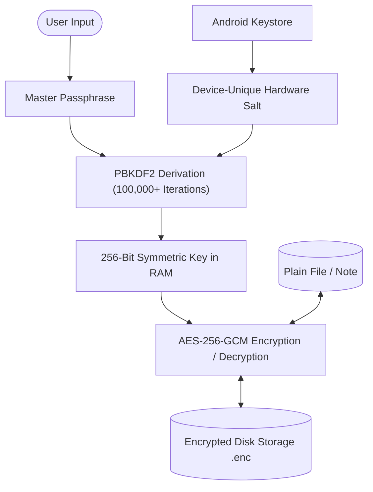

## Executive Summary

Mimic is a dual-state mobile application engineered in Flutter for Android. On the surface, it is an engaging, fully featured 2–8 player social deduction party game. Underneath, it contains an authenticated, hardware-anchored **AES-256-GCM encrypted personal vault** designed to store sensitive photographs, videos, documents, and private notes.

Key design constraints:
- **Zero Cloud Infrastructure**: No user accounts, no remote backend servers, no analytics beacons, and no tracking.
- **Zero Network Permissions**: The Android manifest deliberately omits the `INTERNET` permission, mathematically guaranteeing that unencrypted or encrypted files cannot be exfiltrated across a network.
- **Hardware-Backed Security**: Cryptographic salts and key derivation leverage the Android Keystore system.

> **Development Status**: Core cryptographic engine, file vault encryption pipeline, and party game engine operational; currently in closed local device hardening.

---

## Core Security Architecture & Engineering Decisions

### 1. Threat Modeling: "Security, Not Disguise"
Many "vault" apps on mobile app stores rely on trivial security through obscurity (e.g. disguise as a calculator where typing `1234=` displays hidden photos).

**The Architectural Flaw**: Once someone discovers that the calculator is a vault, the security collapses. If someone connects the device to a computer via ADB or inspects the app's internal sandbox storage (`/data/data/com.mimic.app/`), plain images and files are immediately accessible.

**Mimic's Threat Model**:
- We assume the adversary has physical possession of an unlocked phone.
- We assume the adversary *knows* Mimic contains an encrypted vault.
- We assume the adversary can pull raw SQLite databases and file blobs via ADB.
- **The Core Mandate**: Even with full physical access and forensic inspection, the vault files must remain an indecipherable stream of cryptographic noise without the master passphrase.



### 2. Cryptographic Pipeline: PBKDF2 & AES-256-GCM
Mimic never stores the user's master passphrase or symmetric key anywhere on disk:

1. **Key Derivation**:
   - Master passphrase is passed into **PBKDF2 (Password-Based Key Derivation Function 2)** with an HMAC-SHA256 pseudo-random function.
   - Executes **100,000+ iterations** using a 256-bit cryptographically secure random salt generated by the platform and sealed inside the **Android Keystore**.
   - This computational cost protects against brute-force dictionary attacks even if the encrypted database is extracted onto high-performance GPU cracking rigs.
2. **Authenticated Symmetric Encryption (AES-256-GCM)**:
   - Files are encrypted using AES in **Galois/Counter Mode (GCM)** with a unique 96-bit initialization vector (IV) per file operation.
   - GCM provides **Authenticated Encryption with Associated Data (AEAD)**. In addition to encrypting the file stream, it generates a 128-bit authentication tag.
   - If an attacker alters even a single bit of the ciphertext on disk, the authentication verification fails during decryption, preventing bit-flipping attacks and corrupted file execution.

```dart
// Conceptual cryptographic encryption block in Dart
import 'package:cryptography/cryptography.dart';

Future<EncryptedPayload> encryptFileBlob(List<int> plainBytes, SecretKey derivedKey) async {
  final algorithm = AesGcm.with256Bits();
  final nonce = algorithm.newNonce(); // 96-bit unique IV

  final secretBox = await algorithm.encrypt(
    plainBytes,
    secretKey: derivedKey,
    nonce: nonce,
  );

  return EncryptedPayload(
    cipherText: secretBox.cipherText,
    nonce: secretBox.nonce,
    macTag: secretBox.mac.bytes, // 128-bit integrity tag
  );
}
```

### 3. Dual-State Partitioning in Flutter
The application maintains two completely isolated presentation pipelines:

- **State A: The Social Deduction Party Game**:
  - Contains full role distribution logic (Infiltrator, Civilian, Saboteur), turn timers, custom rule presets, and scoring loops.
  - Built with responsive Flutter widgets that look and perform like an authentic indie board game.
- **State B: The Encrypted Vault**:
  - Activated only via a specialized interaction threshold.
  - Operates a local file manager, thumbnail decrypter, and note editor.
  - **Memory Hygiene**: Once decrypted bytes are rendered onto the screen (e.g. an image widget), plain byte buffers are systematically overwritten and marked for immediate garbage collection to minimize the attack window in device memory.

| Layer | Implementation | Security Benefit |
| :--- | :--- | :--- |
| **Cipher** | AES-256-GCM (AEAD) | Military-grade confidentiality + cryptographic integrity |
| **Key Derivation** | PBKDF2 (100,000+ iterations) | Robust defense against brute-force GPU attacks |
| **Salt Storage** | Android Keystore | Hardware-backed salt isolation |
| **Network Surface** | `INTERNET` permission omitted | Mathematical guarantee against remote data leaks |
| **Local Storage** | Sandboxed encrypted blobs | Zero plaintext remnants on device disk |

---

## Retrospective & Key Takeaways

1. **Memory Life-Cycles in Managed Runtimes**: Dart and Flutter manage memory via garbage collection. Clearing cryptographic keys requires explicitly overwriting byte arrays with zeros before disposing references, rather than simply setting objects to `null`.
2. **Streaming Large Encrypted Files**: Loading an entire 200MB encrypted video into memory causes mobile Out-Of-Memory (OOM) crashes. Architected chunk-based streaming decryption so media players read decrypted chunks on the fly.
3. **User Experience vs. Security Paranoia**: Balancing uncompromising cryptographic safety with a frictionless, enjoyable party game UI proved that privacy-focused engineering doesn't need to look clinical or intimidating.
